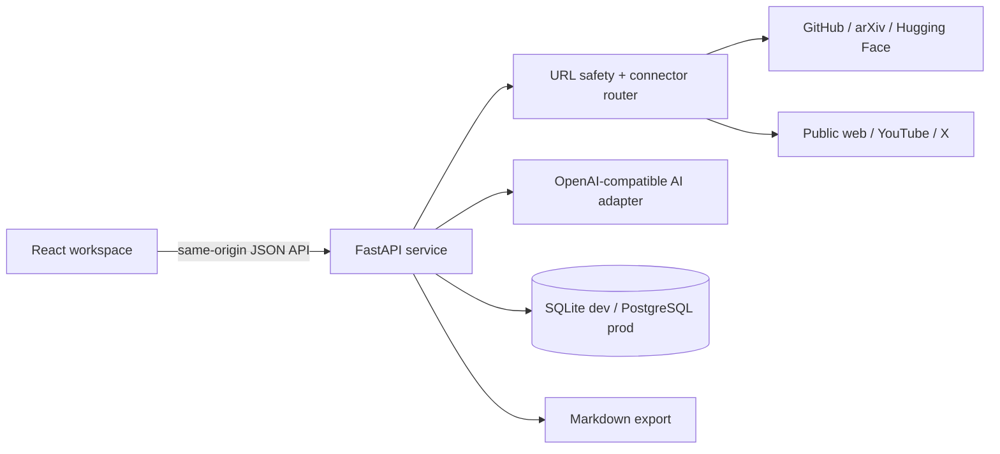

# Expert Content Studio — Design Spec

**Status:** Proposed — awaiting user review  
**Date:** 2026-08-11  
**ArchitectureReviewRequired:** yes

## 1. Intent and boundary

Create a locally runnable web application that turns a public expert-content URL into a durable personal knowledge record. The user can import a URL, see the extracted source and Chinese translation, ask questions against that record, distil a reusable Skill document, edit its Markdown, and keep all resulting artifacts in a searchable knowledge base.

### TaskIntentDraft

- **Outcome:** a working three-pane content studio rather than a static mockup.
- **Success evidence:** a supported public URL can be fetched server-side, normalized and saved; the user can trigger translation and Skill distillation through a configured AI provider; generated Markdown and knowledge records persist across restart.
- **Stop condition:** the full single-user ingest-to-knowledge-to-Skill path works locally with documented environment configuration.
- **Non-goals:** multi-user accounts, billing, collaborative editing, autonomous background crawling, training a model, and bypassing source-platform authentication or paywalls.

### BaselineReadSetHint

- The workspace was empty before this spec.
- The supplied visual reference establishes a high-density, three-pane studio: source input and knowledge library on the left, editable article workspace in the center, and AI chat/Markdown preview on the right.
- The reference content was inspected visually and through its accessible UI structure; no source code or hidden data was copied.

### ImpactStatementDraft

- **Affected layers:** browser UI, HTTP API, source connectors, AI adapter, persistence, and file export.
- **Invariant:** the backend owns URL retrieval, canonical source records, provider secrets, derived artifacts, and state transitions. The browser never calls a third-party source or model provider with a secret.
- **Compatibility:** AI calls use an OpenAI-compatible protocol so OpenAI and DeepSeek-style endpoints can be selected by environment configuration.

## 2. Product workflow

1. The user pastes an X, GitHub, YouTube, arXiv, Hugging Face, or normal web URL.
2. The API validates and canonicalizes the URL, selects the corresponding connector, and creates an import record.
3. The connector retrieves only publicly available metadata and text, then returns normalized source blocks with provenance.
4. The service persists the original record and marks the import ready, partial, or blocked with a specific reason.
5. The user runs one of three derivations: Chinese translation, knowledge summary, or Skill distillation. The AI adapter stores every derived Markdown artifact as a new version.
6. The workspace lets the user edit the current Markdown. Saving creates a user-edited version without overwriting the imported source.
7. The knowledge library is searchable by title, URL, platform, tags, and derived text. A generated Skill can be copied or downloaded as Markdown.

The initial release is intentionally single-user. Each imported content item is an isolated answering context; cross-library retrieval is deferred until basic ingest quality is proven.

## 3. Architecture



### Canonical owners

| Concern | Canonical owner | Rule |
| --- | --- | --- |
| URL safety, redirects and source retrieval | `connectors` service | No browser-side fetching or secret-bearing calls. |
| Source identity and provenance | `sources` table | Original URL and extracted metadata are immutable after import. |
| Translation, summary, chat and Skill derivation | `ai` service | Provider configuration is server-only; every result has a version and provenance. |
| Knowledge search and editing | `knowledge` service | User edits create a derived artifact; they never mutate raw extraction. |
| Presentation state | React client | It renders server state and holds only transient form/editor state. |

### First-principles review

- **First Principle:** transform accessible source material into traceable, reusable knowledge without losing the origin.
- **Non-negotiables:** no secret reaches the client; unsupported or restricted sources are reported honestly; raw source and user/AI derivatives remain distinguishable.
- **Assumptions to drop:** a link can always be scraped; the same extraction method works for every platform; an AI response can replace source provenance.
- **Smallest sufficient path:** one FastAPI process and one relational database, with typed connectors and a single OpenAI-compatible AI boundary.
- **Escalation signal:** introduce a worker queue, vector search, user authentication, or a paid third-party extraction service only after their concrete operational need is demonstrated.

### Architecture integrity lens

- **Invariant:** only the backend may convert a remote URL into a canonical source record or invoke the model with configured credentials.
- **Canonical owner / contract:** connector output conforms to a shared `NormalizedSource` contract; derived output conforms to an `Artifact` contract.
- **Responsibility overlap:** the UI must not parse platform-specific payloads, save fake content after a failure, or call model vendors directly.
- **Higher-level simplification:** one connector router and one AI adapter avoid platform/LLM branches spread through route handlers and components.
- **Retirement / falsifier:** if imports need long-running retries or concurrent throughput beyond a single process, move job orchestration into an explicit queue instead of adding request-level fallbacks.
- **Verdict:** proceed with a single service and explicit adapters.

## 4. Source ingestion and platform boundaries

| Source | First implementation | Constraint and status behavior |
| --- | --- | --- |
| Normal blog/article | server download + readability extraction | Saves title, author/date when available, clean text and canonical URL. |
| GitHub | public GitHub REST API plus raw README fallback | Token optional for higher rate limits; private repositories are not supported. |
| arXiv | arXiv API metadata plus abstract/PDF landing content | Saves paper metadata and abstract; full-PDF parsing is deferred. |
| Hugging Face | public Hub API plus model/dataset card | Saves model/dataset metadata and README/card Markdown. |
| YouTube | oEmbed/video metadata plus public transcript extraction when available | If captions are absent/restricted, save metadata and mark transcript as unavailable. |
| X | X API v2 when `X_BEARER_TOKEN` is configured; otherwise public oEmbed/card metadata only | Complete post text is never fabricated. Restricted or unavailable posts return a `blocked` status explaining how to configure access. |

All remote retrieval follows allow-list and SSRF protections: HTTPS only, hostname/IP validation before and after DNS resolution, rejection of loopback/private/link-local ranges, redirect validation, response-size ceilings, MIME checks, request timeouts, and a small per-host rate limit. The app does not circumvent authentication, paywalls, robots controls, or platform access restrictions.

## 5. Data model

```text
Source
  id, canonical_url, platform, title, author, published_at,
  raw_text, source_markdown, metadata_json, import_status, failure_reason,
  created_at, updated_at

Artifact
  id, source_id, kind (translation | summary | skill | user_edit),
  title, markdown, language, parent_artifact_id, model_metadata_json,
  created_at, updated_at

KnowledgeNote
  id, source_id, artifact_id, tags_json, pinned, created_at, updated_at

ChatTurn
  id, source_id, question, answer_markdown, citations_json, created_at

AppSetting
  key, value_json, updated_at
```

`Source` is the source-of-truth for ingestion. `Artifact` is append-only by default, allowing the UI to show original, translation, and Skill versions separately. `KnowledgeNote` supports library-specific metadata without duplicating content.

## 6. API contract

| Method and route | Purpose |
| --- | --- |
| `POST /api/imports` | Validate a URL, create a source and synchronously run its connector. Returns source plus status. |
| `GET /api/sources` | Search/paginate knowledge records by query, platform and tag. |
| `GET /api/sources/{id}` | Read canonical source, artifacts and import status. |
| `POST /api/sources/{id}/derive` | Create `translation`, `summary`, or `skill` artifact with the selected model profile. |
| `PATCH /api/artifacts/{id}` | Save an intentional user edit as a new version. |
| `POST /api/sources/{id}/chat` | Answer from the selected source and its derived artifacts, returning source citations. |
| `GET /api/artifacts/{id}/download` | Download a safely named `.md` file. |
| `GET/PATCH /api/settings` | Read and update non-secret provider display settings; secrets stay in environment variables. |
| `GET /api/health` | Confirm database and configured provider availability without exposing secrets. |

Failed imports and derivations use structured error codes (`unsupported_url`, `restricted_source`, `transcript_unavailable`, `provider_not_configured`, `provider_error`) that the UI maps to actionable messages.

## 7. AI behavior

Environment variables select an OpenAI-compatible endpoint, API key, model and optional model label. The adapter sends structured system prompts that require:

- Chinese translation preserving links, terminology and headings;
- a concise knowledge summary with claims separated from source facts;
- Skill Markdown with purpose, when-to-use, inputs, procedure, caveats and source link;
- answers grounded only in the selected source and generated artifacts, with citations to source sections.

If the provider is absent, the app remains usable for extraction, editing, searching and export; AI commands show a configuration action rather than simulated output.

## 8. User experience

The interface follows the supplied reference's dense desktop workspace while using original content and implementation:

- **Header:** wordmark, universal URL field, import action, connection/auto-save state and settings.
- **Left pane:** searchable knowledge library, source-type badges, saved-item count and empty state.
- **Center pane:** title/provenance, Original / Chinese translation / Distilled Skill tabs, Markdown toolbar, editable textarea and reading statistics.
- **Right pane:** AI knowledge chat and rendered Markdown preview, downloadable Markdown, desktop/mobile preview mode and visual theme selector.
- **States:** loading, partial import, blocked source, model configuration missing, derivation progress, successful save and source-cited answer.

Core controls must mutate real local application state and call the above API; they may not be visual-only buttons.

## 9. Validation and acceptance

1. An accessible GitHub README or normal public article imports into the database and remains visible after service restart.
2. A plain unsupported URL is rejected with a clear status, not an uncaught error.
3. A configured OpenAI-compatible endpoint produces and stores a Chinese translation and Skill artifact.
4. With no AI credentials, import and export still work and the UI exposes a configuration-needed state.
5. Markdown edits create a newer artifact without changing `Source.raw_text`.
6. Library search finds sources by title and URL.
7. The source-scoped chat response includes source citations and refuses to invent unavailable source content.
8. SSRF test cases for `localhost`, loopback and private IPv4 ranges are rejected before request dispatch.
9. The responsive UI supports desktop and a narrow mobile viewport without clipped core content.

## 10. Deferred work and risks

- Import runs in-request for the initial version. Long documents and queued retries are deferred until the single-process lifecycle is insufficient.
- SQLite is the local default. PostgreSQL is selected by `DATABASE_URL` for deployment; migrations must be database-agnostic.
- AI quality, provider quota and X/YouTube access depend on user-provided credentials and platform rules. The app records limitations rather than presenting generated text as fetched source material.
- Cross-source semantic retrieval, embeddings, authentication, private repositories, full PDF OCR, and production crawling policies are out of scope for this release.

