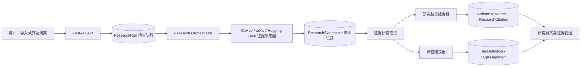

# 深度研究知识库设计规格

**状态：** 已确认设计，等待书面规格审阅  
**日期：** 2026-08-23  
**ArchitectureReviewRequired：** 是

## 1. 目标与边界

将公开的 GitHub 仓库、arXiv 论文与 Hugging Face 模型/数据集沉淀为可追溯、可检索、可编辑的研究档案。结果必须体现对代码、全文论文或 Hub 工件的实质性研究，而不是对 README、摘要或模型卡的表面总结。

每个研究档案中的关键结论必须可追溯到采集的原始证据；系统必须显示实际覆盖范围与未覆盖材料，不能把未读取的内容写成已验证的结论。

### TaskIntentDraft

- **Outcome：** 三种来源均可产生专业中文研究档案、可解释标签与证据索引，并作为个人研发学习库持续检索。
- **Success evidence：** 对每种来源的公开固定夹具，系统能持久化研究运行、证据、带有效引用的 `research` Artifact 和标签建议；用户可以确认或编辑标签，且在重启后仍可查看结果和覆盖率。
- **Stop condition：** GitHub、arXiv 与 Hugging Face 都走通“采集 → 证据化 → 研究报告 → 标签 → 检索”的手动与自动入口；现有导入、翻译、摘要、Skill、聊天和编辑不回归。
- **Non-goals：** 私有/受限材料获取、绕过认证或平台规则、下载模型权重或完整数据集、OCR 扫描件、跨来源语义问答、多人协作、分布式任务集群与自动训练模型。

## 2. 基线与变更判定

现行规格规定 GitHub 仅导入元数据与 README，arXiv 仅导入元数据与摘要，Hugging Face 仅导入元数据与卡片，并明确将全文 PDF 和后台队列延后。本规格替换这些限制，仅对三类深度研究工作流生效；其余来源仍保留现有导入行为。

### BaselineReadSetHint

- `README.md`：当前来源访问和 AI 配置边界。
- `docs/aegis/specs/2026-08-11-expert-content-studio-design.md`：当前产品与架构基线。
- `backend/app/services/connectors/`、`knowledge.py`、`ai.py`：现有采集、持久化与 AI 边界。
- `backend/app/models.py`、`backend/app/schemas.py`、`backend/app/api/`：现有数据/API 契约。
- `frontend/src/components/EditorWorkspace.tsx`、`KnowledgeSidebar.tsx`：现有知识库工作区。

### ImpactStatementDraft

- **Affected layers：** 平台采集器、PDF 解析、研究编排、AI 适配器、数据库迁移、HTTP API、前端工作区和测试夹具。
- **Invariant：** 服务端是唯一可抓取远程来源、持有密钥、创建研究状态和保存证据的组件；浏览器只读取状态并发出明确的用户动作。
- **Compatibility：** `Source` 与历史 Artifact 均不被重写；研究报告作为新增 append-only Artifact 类型；旧的知识笔记标签迁移为可见的已确认自定义标签。

### Baseline Role Alignment

- **Product / Requirement Baseline：** 本规格的深度、可追溯、三来源、双触发和标签治理需求。
- **Architecture / Runtime Boundary Baseline：** 后端 connector/AI/persistence 边界、公开来源安全策略及 append-only Artifact 语义。
- **Result：** Design Defect，scope: requirements | architecture。旧规格有意延后了本需求必需的全文、代码证据与持久任务。
- **Next action：** 以本规格建立研究编排器和持久研究实体；不在旧的 `summary` 生成路径中叠加平台分支。

## 3. 架构

`ResearchOrchestrator` 是研究流程、运行状态、覆盖判定和证据关系的唯一 owner。平台采集器只安全地获取并规范化材料；AI 服务只从给定证据生成研究笔记、报告或标签建议；前端不得解析平台专有响应，也不得构造研究结论。

### Architecture Integrity Lens

- **Invariant：** 每个研究结论和 AI 标签建议都能指向同一研究运行中已保存的证据。
- **Canonical owner / contract：** `ResearchOrchestrator` 以 `ResearchRun`、`ResearchEvidence` 和 `ResearchCitation` 为合同；现有 connector 与 `AIService` 是它的依赖，不是并列的研究 owner。
- **Responsibility overlap：** 普通 `summary` 继续是简短衍生内容，不能兼任研究报告；`KnowledgeNote.tags_json` 不再兼任标签真相来源。
- **Higher-level simplification：** 通过一个统一研究流水线承载三种来源，而不是在每个 API 路由、编辑器标签页和摘要 prompt 内分别增加平台分支。
- **Retirement / falsifier：** 旧标签 JSON 迁移后仅保留历史兼容用途；若单进程 worker 不能满足并发或可靠性需求，替换 worker 实现但保留 `ResearchRun` API 与数据合同。
- **Verdict：** 采用统一持久化研究管线。

## 4. 采集范围与证据合同

每次研究在开始时快照其预算；预算不会因重试或将来的设置变更而改写。每个被发现的材料都记录为“已采集”或“未采集”，并带有原因。只有已采集材料能成为 `ResearchEvidence` 和报告引用的依据。

| 来源 | 首期公开材料 | 默认预算 | 排除规则 |
| --- | --- | --- | --- |
| GitHub | 仓库元数据、默认分支 commit、递归 tree、README/架构文档/License、依赖清单、优先级最高的源码 | 最多 20 个文本文件、总解析文本 1.5 MiB | 二进制、生成物、vendor、minified、依赖目录、超限或非文本文件不读取 |
| arXiv | Atom 元数据、对应版本的公开 PDF、页码和可解析章节 | PDF 最大 25 MiB、最多 60 页、解析文本最多 500k 字符 | 不做 OCR；加密、损坏、扫描件、超限 PDF 标记为部分研究 |
| Hugging Face | Hub 元数据、README/card、配置、公开小型说明或脚本 | 最多 12 个文本/配置文件、总解析文本 1 MiB | 不下载模型权重、dataset payload、二进制或超限文件 |

GitHub 的选择顺序是：架构/设计文档、依赖与构建清单、应用入口、被其他源码引用较多的模块、其余小型源码。采集器保存 commit SHA、路径和行范围；正文解析失败时保留路径和排除原因。若 GitHub 的递归 tree 响应被平台截断，运行必须标为 `partial` 并记录该截断，不能假定未返回路径不存在。

arXiv 证据以论文版本、页码、章节标题和段落序号定位。Hugging Face 证据以仓库类型、revision、路径和行范围定位。所有证据均有内容哈希与采集时间。报告显示“已分析/已发现”的数量及排除原因汇总，并可展开查看清单。

公开 URL、DNS、重定向、MIME、响应大小和每主机速率继续受当前安全 HTTP 层控制。组合层将共享 `SafeHttpClient` 配置为每主机每 60 秒最多 40 次请求，且单个研究运行不得向任何主机发出超过 32 次公开请求；不能取消主机限制或允许任意递归抓取。PDF 使用专属大小上限，不能放宽其他连接器的通用 5 MiB 响应限制。

## 5. 数据模型

现有 `Source` 是来源身份与初始导入材料的 source of truth，永不被深度采集覆盖。现有 `Artifact` 保持 append-only；新增 `research` kind，并通过可空 `research_run_id` 指向其生成运行。用户编辑研究报告时继续创建 `user_edit` 子版本。

| 实体 | 关键字段与职责 |
| --- | --- |
| `ResearchRun` | `source_id`、`trigger`（manual/automatic）、`status`、`phase`、预算快照、覆盖摘要、尝试次数、时间戳、租约、失败代码和非密钥 provider 元数据 |
| `ResearchEvidence` | `research_run_id`、稳定 locator、类型、标题、顺序、源 revision、正文/哈希、证据研究笔记及其非密钥模型元数据、状态（included/excluded）和排除原因 |
| `ResearchCitation` | `artifact_id`、`evidence_id`、报告中的稳定标记（如 `E12`）及可选段落锚点 |
| `TagDefinition` | canonical slug、名称、所属维度、父标签、系统/用户定义标志和说明 |
| `TagAssignment` | `source_id`、可选 `research_run_id`、`tag_id`、来源（metadata/ai/user）、状态（suggested/accepted/rejected）、置信度和时间戳 |
| `TagAssignmentEvidence` | `tag_assignment_id` 与 `evidence_id` 的多对多关系 |

同一来源一次只能有一个 `queued` 或 `running` 研究运行。再次请求会返回该活跃运行，而不是重复消耗资源。用户确认的标签是来源级持久事实，不被后续运行替换；新运行只能产生新的建议。标签层级的五个顶级维度是领域、方法/架构、任务/能力、工程/生态、研究属性。父标签筛选包含其后代，精确标签筛选只匹配该标签。

`KnowledgeNote.tags_json` 中已有值迁移为 `TagDefinition` 中的自定义标签和 `accepted` 的用户标签分配；之后库内标签搜索只使用 `TagAssignment`。保留 `KnowledgeNote` 的收藏/来源关联职责，不删除已有记录。

## 6. 研究运行与 AI 行为

### 6.1 触发、状态和恢复

设置 `research.auto_start` 默认关闭。关闭时，来源详情显示“开始深度研究”；开启时，支持的三类来源在成功导入后自动排入同一队列。手动与自动运行使用同一预算、同一编排器和同一输出合同。

状态为 `queued`、`running`、`completed`、`partial`、`blocked`、`failed`。运行中的阶段为 `collecting`、`digesting`、`synthesizing` 和 `tagging`。

首期在应用 lifespan 内运行一个持久化、单 worker 的轮询器：数据库中的短期租约保证一个运行只由一个 worker 领取；启动时过期租约回到可领取状态。此版本的部署不支持多个同时启用 worker 的后端副本。临时网络和 provider 错误最多自动重试两次，使用持久化退避时间；受限来源、预算超限、解析错误和未配置 AI 均不盲目重试，并转为 `partial`、`blocked` 或 `failed`，带安全的机器错误码。

### 6.2 证据驱动的生成

AI 分两阶段工作：

1. 每个纳入证据生成一份来源受限的研究笔记；该笔记隐式绑定该证据 ID。
2. 综合器只读取这些研究笔记和运行覆盖信息，生成中文 Markdown 研究档案。每个实质性段落必须包含至少一个 `[E<n>]` 引用。

报告使用固定章节模板。服务端解析引用标记，拒绝未知证据 ID，并要求“背景/目标”至“复现/应用建议”各章节的每个非空正文段落存在有效引用；“研究范围与覆盖率”“标签”和“证据索引”是结构性章节，不参与该段落规则。一次格式修复后仍不满足合同的报告不发布为 `completed`；运行保留证据并标为 `partial` 或 `failed`。标签建议以结构化输出生成，每个标签必须提供置信度和一个或多个证据 ID，否则该建议被丢弃。

系统 prompt 明确将代码、README、模型卡、论文和任何外部文本视为不可信研究数据，忽略其中要求改变系统行为、泄露密钥或跳过证据的指令。AI 不能使用未提供的外部知识来补足证据缺口。

### 6.3 研究档案模板

所有研究档案包括：研究范围与覆盖率、背景/目标、核心贡献、方法或架构、实现/实验/配置、关键结果、局限与风险、复现/应用建议、标签和证据索引。

- GitHub 额外包括模块边界、调用流、依赖、构建/测试方式和工程取舍。
- arXiv 额外包括问题定义、方法细节、实验设置、基线、指标、消融与结论有效范围。
- Hugging Face 额外包括工件类型、配置、任务/基准、使用集成、许可/风险及与论文/代码/数据的公开关联。

推断必须标记为“基于证据的解读”，与原始事实分开陈述。

## 7. HTTP API

现有 API 保持可用，新增字段只追加到 JSON 响应，不移除既有字段。

| 端点 | 合同 |
| --- | --- |
| `POST /api/sources/{id}/research` | 创建手动运行或返回该来源的活跃运行；成功为 `202 Accepted` |
| `GET /api/research-runs/{id}` | 返回状态、阶段、进度、覆盖摘要、报告引用和标签建议摘要 |
| `GET /api/research-runs/{id}/evidence` | 分页返回包含/排除的证据记录和可安全展示的 locator |
| `GET /api/tags` | 搜索或读取五维标签树 |
| `POST /api/sources/{id}/tags` | 创建并确认来源的自定义标签 |
| `PATCH /api/tag-assignments/{id}` | 确认或拒绝建议；只允许状态变更和明确的用户动作 |
| `DELETE /api/tag-assignments/{id}` | 移除用户确认或自定义标签，不删除标签定义和历史研究运行 |
| `GET /api/sources` | 现有 `tag` 查询改按已确认 `TagAssignment` 过滤 |
| `GET /api/sources/{id}` | 追加研究运行摘要、研究 Artifact 引用和标签摘要 |
| `GET/PATCH /api/settings` | 追加 `research.auto_start`，既有仅更新 `presentation` 的客户端仍合法 |

新错误码包含 `research_not_found`、`research_not_supported`、`research_unavailable`、`research_worker_unavailable` 和 `research_already_running`。对外消息不返回远端正文、文件系统路径、凭据、DNS 细节或 provider 诊断。

## 8. 用户体验

来源详情新增“深度研究”标签页。未开始时显示范围说明和“开始深度研究”操作；运行中显示当前阶段、进度和覆盖计数；终态时显示“重新研究”，以新的预算快照创建下一次运行。完成或部分完成时显示可编辑研究报告、可点击的 `[E<n>]` 证据引用和可展开的覆盖清单。用户编辑报告时保留原始研究 Artifact 和其引用图；编辑版本明确标为用户修改版，不宣称已通过模型的逐段引用验证。

标签区按五个维度分组显示已确认标签与待确认建议。用户可确认、拒绝、添加或删除标签；自动建议显示来源和置信度。侧栏的标签筛选只统计已确认标签，并显示来源的研究状态。设置面板提供“新导入来源自动深度研究”开关。

前端以有界轮询读取 `ResearchRun`，在终态、来源切换、请求失败或组件卸载时停止。研究进行期间，用户仍能导入其他来源、阅读原文、使用历史 Artifact、编辑保存和检索库。

## 9. 验收与验证

1. GitHub 夹具生成树、关键文件、覆盖清单和带 `ResearchCitation` 的研究报告；报告描述真实模块/依赖，不只复述 README。
2. arXiv 夹具解析公开 PDF 的页码与正文，报告包含方法和实验引用；超过页数/大小时明确部分覆盖。
3. Hugging Face 夹具导入 card、元数据和配置/小型脚本，且不请求权重或数据 payload。
4. 手动研究返回可轮询的持久运行；自动开关开启后导入会创建相同种类运行；重启后可恢复租约过期的任务。
5. 无效或未知 `[E<n>]` 引用不能产生 `completed` 报告；每个 AI 标签建议至少有一个真实证据。
6. 用户确认的标签在下一次运行后仍保持；历史 `tags_json` 迁移为可检索的已确认自定义标签。
7. 受限、二进制、超限、损坏 PDF、AI 未配置和 provider 暂时失败均产生诚实状态，不伪造报告或标签。
8. 原有 URL 安全、连接器、导入、AI、Artifact、聊天、后端 API 与前端工作区测试继续通过。
9. 前端测试覆盖开始、轮询、终态、证据展开、标签确认、自动开关与请求取消；窄视口不隐藏核心研究状态。

## 10. 非目标、风险与扩展触发条件

首期不实现跨来源向量检索、论文 OCR、完整 Git clone、完整数据集分析、重量级静态分析、多人权限或分布式 worker。研究报告并不证明代码可运行、论文结论可复现或模型安全；它只陈述已获取证据支持的分析及其范围。

当单 worker 队列持续产生等待、需要多个后端副本，或单次研究预算不足以满足已证实的使用需求时，可将 worker 换为独立队列消费者。此变化必须保留 `ResearchRun` 状态机、证据数据和公开 API，不能在客户端引入另一个运行状态真相来源。

## 附录：第一性原理检查

- **First Principle：** 让研发人员能从公开技术材料中获得可验证、可复用的深入理解。
- **Non-negotiables：** 来源公开且安全；每个关键结论有证据；覆盖缺口可见；密钥不离开服务端；历史来源与 Artifact 不可改写。
- **Assumptions to Drop：** README 或摘要足以代表项目/论文；一段单次 LLM 输出等同研究；自由关键词可形成长期知识库；同步 HTTP 请求适合深度处理。
- **Smallest Sufficient Path：** 一套三来源共用、数据库持久化、单 worker 的证据研究管线，而非首期引入分布式任务基础设施。
- **Escalation Signal：** 需要多实例吞吐、跨来源知识图谱或超预算全量材料时，重新评审 worker、检索和存储架构。
